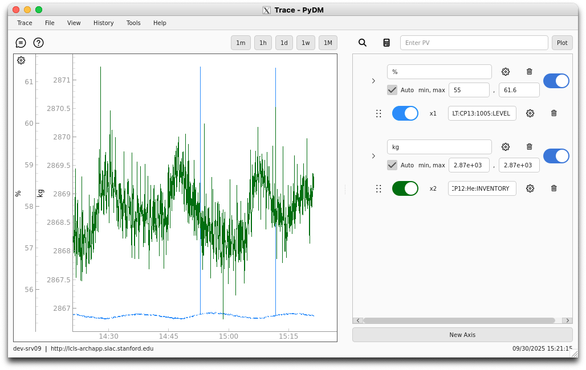

# Interface Layout & Sections

Trace is a PyDM application used to plot value data for given PVs.
The application is capable of plotting both live and archived data, as well as [formulas] containing PVs as variables.

  [formulas]: traces.md#formula-traces

The application consists of two main parts:

- [Plot Section] on the left
- [Configuration Section] on the right
- [Footer] at the bottom

  [Plot Section]: overview/plot_section.md
  [Configuration Section]: overview/config_section.md
  [Footer]: overview/footer.md

Users are able to control the size of these two sections by clicking and dragging the vertical white splitter in the center of the application.
The configuration section can be completely collapsed so that the application only shows the plot.
