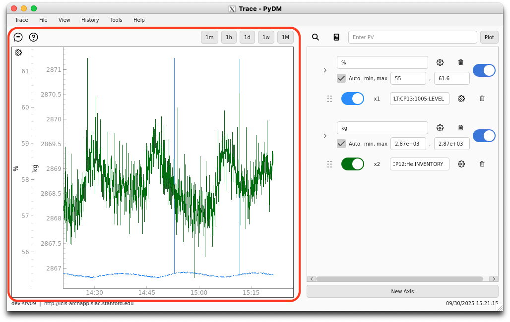

# Plot Section & Mouse Interaction

<figure markdown="span">
  
</figure>

The plot section is primarily for viewing the plot, but also has some control over the plot's settings.
It displays whatever traces, axes, or other properties the user sets.

## Mouse Controls

The plot's axes can be controlled using the mouse. Users can scroll up to zoom in, or scroll down to zoom out. If this is done over a single axis, then just the one axis is affected.
However, if the user scrolls in the plotting area, then the X-Axis and all Y-Axes will zoom in the corresponding direction.

Users are able to pan along a single axis by clicking and dragging it. This works on both X and Y-Axes.
Clicking and dragging in the plotting area has a different functionality.
A box will be drawn between where the mouse button was pressed and where it was released, and then the plot will zoom in to show the selected range.

## Time Span Buttons

Above the plotting section are a few buttons for quickly toggling between common time spans (30s, 1m, 1h, 1w, 1M).
Clicking these will cause the plot to consistently update to show that time range.
For instance, toggling the 1h button will result in the last hour of data being shown, and every 5 seconds the plot will shift to the right to update.

## Time Span LineEdit

Next to the time span buttons is a LineEdit where the user can enter any timescale as an int or float, with the last character specified as
'm', 'h', 'd', 'w', or 'M' to specify minutes, hours, days, weeks, or months. Entering a timescale here and hitting the return key will
result in the specified timescale being displayed on the plot. For example, entering '1h' will display the last hour of data, '2w' will display the last two weeks.

## Plot Settings

Users can change the settings of the plot using the settings button in the top left corner of the plot marked with a :octicons-gear-24: icon.
Clicking this button opens a pop-up window with controls over the plot's configuration such as background color, time-range, show gridlines, etc.
