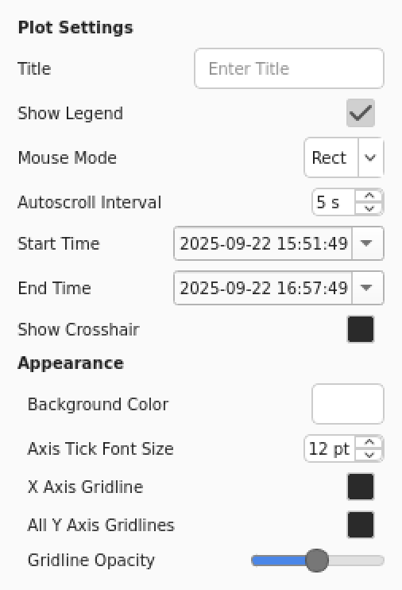

# Plot Configuration

The Plot Settings modal allows you to customize the appearance and behavior of your plot. These settings are saved with Trace configuration files (`.trc`) and can be shared between users.

Access the Plot Settings by clicking the gear icon (:octicons-gear-16:) in the top-right corner of the plot area.

<figure markdown="span">
  { width=300 }
</figure>

  The Plot Settings modal showing all available configuration options

## Basic Settings

### Plot Title
- **Purpose**: Set a custom title for your plot
- **Default**: No title
- **Usage**: Enter text in the "Title" field
- **Note**: The title is centered at the top of the plot

### Legend
- **Purpose**: Show/hide the plot legend
- **Default**: Enabled
- **Usage**: Check/uncheck "Show Legend"
- **Note**: The legend displays trace labels and their colors

### Mouse Mode
- **Purpose**: Control how mouse interactions work
- **Options**:
    - **Rect** (default): Click and drag to zoom to a rectangular area
    - **Pan**: Click and drag to pan the plot view
- **Usage**: Select from the "Mouse Mode" dropdown

## Time Range Settings

### Start Time & End Time
- **Purpose**: Set specific time boundaries for the plot
- **Default**: Current plot range
- **Usage**: Use the date/time pickers to set start and end times
- **Features**:
  - Calendar popup for easy date selection
  - Format: `yyyy-MM-dd HH:mm:ss`
  - Automatically disables autoscroll when changed

### Autoscroll Interval
- **Purpose**: Control how often the plot updates during autoscroll
- **Default**: 5 seconds
- **Range**: 1-60 seconds
- **Usage**: Adjust the "Autoscroll Interval" spinbox

## Appearance Settings

### Background Color
- **Purpose**: Set the plot background color
- **Default**: White
- **Usage**: Click the color button to open a color picker
- **Note**: Changes are applied immediately

### Axis Tick Font Size
- **Purpose**: Control the size of axis tick labels
- **Default**: 12 points
- **Usage**: Adjust the "Axis Tick Font Size" spinbox
- **Note**: Smaller fonts show more tick marks, larger fonts show fewer

### Crosshair
- **Purpose**: Display a crosshair cursor on the plot
- **Default**: Disabled
- **Usage**: Check/uncheck "Show Crosshair"
- **Note**: Yellow crosshair follows mouse movement

## Grid Settings

### X-Axis Gridlines
- **Purpose**: Show/hide horizontal gridlines
- **Default**: Disabled
- **Usage**: Check/uncheck "X Axis Gridline"

### Y-Axis Gridlines
- **Purpose**: Show/hide vertical gridlines for all Y-axes
- **Default**: Disabled
- **Usage**: Check/uncheck "All Y Axis Gridlines"

### Gridline Opacity
- **Purpose**: Control the transparency of gridlines
- **Default**: ~50% (127/255)
- **Range**: 0-255 (0 = transparent, 255 = opaque)
- **Usage**: Use the opacity slider
- **Note**: Affects both X and Y axis gridlines

## Configuration Persistence

All plot settings are automatically saved when you:
- Save a Trace configuration file (`.trc`)
- Export your current setup

Settings are restored when you:
- Load a Trace configuration file
- Start Trace with a saved configuration

## Keyboard Shortcuts

- **Ctrl+T**: Toggle between light and dark themes
- **Ctrl+I**: Save plot as image
- **Ctrl+E**: Post to E-Log

## Tips

1. **Screenshots**: Configure appearance settings before taking screenshots for presentations
2. **Sharing**: Save your configuration to share plot styles with colleagues
3. **Performance**: Higher autoscroll intervals reduce CPU usage but may feel less responsive
4. **Accessibility**: Larger font sizes and higher gridline opacity improve readability