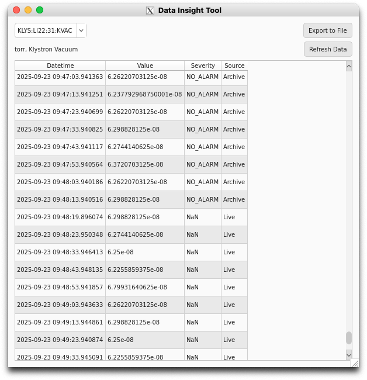

# Data Insight Tool

### Overview
The Data Insight Tool (DIT) lets you inspect and export all data for a single curve on the current plot within the plot's time range. It aggregates both live samples already shown on the plot and archived samples fetched from the Archiver Appliance for the same time window.

### What you can do
- **View data**: See a combined table of timestamps, values, severities, and whether each row came from Live or Archive.
- **Inspect metadata**: See the curve's unit and description (fetched from `<PV>.EGU` and `<PV>.DESC`).
- **Refresh**: Re-query data for the current plot time range.
- **Export**: Save the combined dataset to CSV, MAT, or JSON with metadata.

### Prerequisites
- The main plot must contain at least one `ArchivePlotCurveItem` (a curve with a valid PV address).
- To fetch archived data, set the environment variable `PYDM_ARCHIVER_URL` to your Archiver Appliance URL (for example, `http://lcls-archapp.slac.stanford.edu`). Without this, only live data already in the plot will be shown.

### Open the tool
The tool can be opened with from the Trace menu or with `Ctrl+D`. It appears as a separate window alongside Trace. The tool has these features:

- A PV selection dropdown
- A loading indicator
- Export and Refresh buttons
- A metadata label (unit and description)
- A data table

### Using the tool
1. **Select a PV**: Use the dropdown to choose the curve (PV) of interest. The list includes curves currently on the plot.
2. **Time range**: The DIT always uses the plot's current X-axis range. Adjust the plot window to change what the DIT loads.
3. **Loading**: A "Loading…" label is shown while the tool fetches archived data.
4. **Combined data**: The table shows four columns:
    - Datetime
    - Value
    - Severity
    - Source ("Live" for plot buffer samples within range, "Archive" for data fetched from the Archiver)
    - **Note**: Rows with Source "Live" currently show Severity as `NaN`. Capturing severity for live data is planned for a future update.
5. **Metadata**: The label above the table displays the curve's unit (if any) and the description fetched from `<PV>.DESC`.
6. **Refresh**: Click "Refresh Data" to re-fetch for the current plot range.

<figure markdown="span">
  { width=500 }
</figure>
/// caption
DIT with data loaded
///

### Exporting data
Click **Export to File** to save the displayed dataset. Choose a filename and one of the formats:

- CSV (`*.csv`)
- MAT (`*.mat`)
- JSON (`*.json`)

<figure markdown="span">
  { width=500 }
</figure>
/// caption
Export dialog with format options
///

Export behavior:

- The exported file includes metadata: Address, Unit, and Description.
- Timestamps are written as seconds since epoch in the data section.
- If there is no data yet (table is empty), the tool will show an error and skip export.

### Notes and troubleshooting
- **No curves on plot**: Add curves to the main display first; otherwise the PV dropdown will be empty.
- **No archiver URL**: If `PYDM_ARCHIVER_URL` is not set, archived data will not be fetched. Only live samples currently buffered in the plot for the selected PV (within the time range) will be shown.
- **Gaps in data**: If the plot time window includes ranges where neither live nor archived data exist, those portions will not produce rows.
