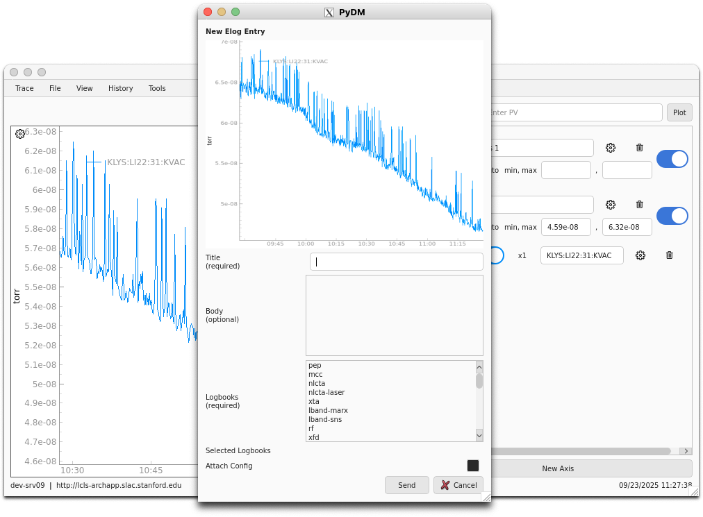

# E-Log Entry Tool

### Overview
The E-Log Entry Tool allows you to create and submit entries to the E-Log system directly from Trace. You can attach a screenshot of your current plot and optionally include your configuration file with the entry.

### Prerequisites
Before using the E-Log Entry Tool, you must set up the following environment variables:

- `SWAPPS_TRACE_ELOG_API_URL`: The base URL for the E-Log API
- `SWAPPS_TRACE_ELOG_API_KEY`: Your API key for authenticating with the E-Log system

### Opening the Tool
The E-Log Entry Tool can be accessed through the Trace menu or with `Ctrl+E`. When opened, it displays a modal dialog with the following components:

<figure markdown="span">
  { width=500 }
</figure>
/// caption
E-Log Entry Tool interface
///

### Using the Tool

#### 1. **Screenshot of the Plot**
  - A screenshot is taken of the plot on startup and is displayed at the top of the dialog
  - The image is scaled to fit within a 400x300 pixel area
  - This screenshot will be attached to your E-Log entry in PNG format

#### 2. **Title** (Required)
  - Enter a descriptive title for your E-Log entry
  - This field is mandatory and must not be empty

#### 3. **Body** (Optional)
  - Provide additional details about your entry in the text area
  - Use this space to describe what you observed, any issues, or relevant context

#### 4. **Logbooks** (Required)
  - Select one or more logbooks from the available list
    - At least one logbook must be selected to submit the entry
  - You can select multiple logbooks using `Ctrl+click` or `Shift+click`
  - The selected logbooks are displayed in the "Selected Logbooks" field below

#### 5. **Attach Config** (Optional)
  - Check this box if you want to include your current Trace configuration file
  - The configuration file will be attached as an additional file to the entry
  - This is useful for sharing your exact plot settings with others

#### 6. **Submit the Entry**
  - Click **Send** to submit your entry to the E-Log
  - Click **Cancel** to close the dialog without saving

### Validation and Error Handling
The tool performs several validation checks before allowing submission:

  - **Title validation**: If the title field is empty, you'll see a warning: "Title is required."
  - **Logbook validation**: If no logbooks are selected, you'll see a warning: "At least one logbook must be selected."
  - **API connectivity**: If the E-Log API is unreachable, you'll see an error dialog with the specific error code

### What Gets Posted
When you submit an entry, the following data is sent to the E-Log API:

  - **Entry metadata**: Title, body text, and selected logbooks
  - **Plot screenshot**: Automatically attached as `trace_plot.png`
  - **Configuration file**: If "Attach Config" is checked, your current `.trc` configuration file is included

### Troubleshooting

#### Common Issues
  - **"Elog Access Error"**: This indicates the E-Log API is unreachable or your API credentials are invalid
    - Verify your `SWAPPS_TRACE_ELOG_API_URL` and `SWAPPS_TRACE_ELOG_API_KEY` environment variables
    - Check your network connection to the E-Log server
  - **Empty logbook list**: The tool couldn't fetch available logbooks from the API
    - Ensure your API key has the necessary permissions
    - Check that the E-Log API is running and accessible

#### Environment Setup
Make sure these environment variables are properly set:
```bash
export SWAPPS_TRACE_ELOG_API_URL="https://your-elog-server.com"
export SWAPPS_TRACE_ELOG_API_KEY="your-api-key-here"
```

### Technical Details
  - The tool uses the E-Log API v2 for posting entries
  - Images are sent as PNG format
  - Configuration files are attached as binary data with `application/octet-stream` MIME type
  - The API requires authentication via the `x-vouch-idp-accesstoken` header
