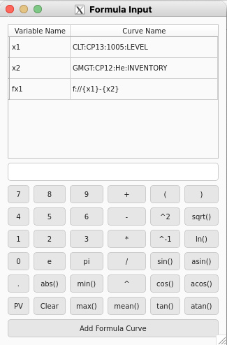

# Formula Maker Tool

The Formula Maker Tool can help users construct [formula traces] for their plot.
The tool can be opened by clicking the :fontawesome-solid-calculator: button in the top of the [configuration section].

  [configuration section]: ../overview/config_section.md

This tool is for ease of use, as users can also create formula traces by creating a trace that's prefixed with `f://`.

<figure markdown="span">
  
</figure>

## Variable List

The top of the tool consists of a list of traces on the plot that users can use in their formula.
The left column contains a variable name for each curve.
To use a variable in the formula it should be surrounded by brackets `{}`.

`Double-clicking` a row will add the variable to the formula.

## Calculator-like Section

The bottom part of the tool consists of a text box that users can type a formula in as well as buttons that users can use to build their formula.

When the user is finished making their formula, they can either hit `Enter` or click the button labeled "Add Formula Curve".

Formulas can include all basic arithmetic and binary operations, as well as `mean` and all functions in Python's [standard math library].

  [standard math library]: https://docs.python.org/library/math.html
