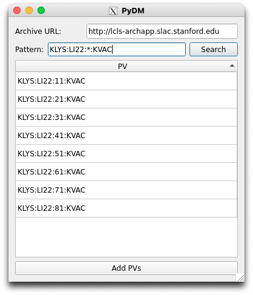

# PV Search Tool

The PV Search Tool can help users find PVs easier.
The button labeled "Search PV" at the top of the [configuration section] opens a PV search tool.

  [configuration section]: ../overview/config_section.md

<figure markdown="span">
  
</figure>

## Wildcard Characters

Users can make searches using a number of wildcard characters.
All wildcards will represent 1+ characters regardless of the wildcard (equivalent of `*.` in [Regular Expression]).

  [Regular Expression]: https://developer.mozilla.org/en-US/docs/Web/JavaScript/Reference/Regular_expressions/Wildcard

For example, the picture above shows a search for `KLYS:LI22:*:KVAC`.
The results include all PVs that have that address with any character in the `*` position.

## Selecting PVs

Use `Ctrl + Click` to toggle separate PVs as selected or not, and `Shift + Click` will select a range of PVs.
`Double-Click` a PV or click the button labeled "Add PVs" to add them to Trace.
New traces will be added to the last axis of the configuration section.
