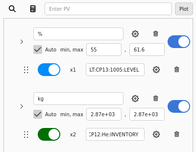

# Traces

Traces, sometimes called curves, are the lines that are shown on the application's plot.
They show both live and archive data for the given channel.

The properties of each trace can be controlled by the user through interaction with the [configuration section] of the application.

  [configuration section]: overview/config_section.md

<figure markdown="span">
  
</figure>

## Adding Traces

Users can add traces to the plot by adding them to the configuration section.
This can be done by entering a channel into the text box at the top of the section and hitting `Enter` or clicking the button labeled "Plot".
Once a channel is added, the trace will be added to the plot and both live and archived data will be shown.
Traces can also be added using the [PV Search tool].

  [PV Search tool]: tools/search.md

When adding new traces, they will be attached to the last y-axis in the configuration section.
If no axes exist, a new one will be created for the new trace.

### :material-wrench: Planned for Future Development

When adding new traces, they will be attached to a y-axis with the same unit.
If no such axis exists, a new one will be created for the channel's unit.
If the channel has no units, a new axis will be created with no associated units.

## Hiding Traces

Users can hide or show individual traces on the plot without removing them.
This can be done by unchecking the box labeled "Active".

## Removing Traces

Users can remove traces from the plot by clicking the :fontawesome-regular-trash-can: button for the associated trace.
This will remove the row from the configuration section and remove the trace from the plot at the same time.

## Moving Traces

When a trace is created it is attached to the last Y-axis in the configuration section, as mentioned above in [Adding Traces].
If users want to move a trace to a different Y-axis, they can click and hold the handle marked with a :material-dots-vertical: symbol.

  [Adding Traces]: #adding-traces

## Formula Traces

Users can add formulas to the plot by entering their formula to be calculated as the trace's channel.
The formula should be prepended with `f://` to signify that the channel is a formula.
Formulas can also be added using the [formula input tool] by clicking the :fontawesome-solid-calculator: button.

  [formula input tool]: tools/formula_maker.md

Other traces the formula uses are represented by their unique variable name in a set of curly brackets, e.g. `{x1}`, `{x4}`, `{fx3}`.
Formulas can include all basic arithmetic and binary operations, as well as `mean` and all functions in Python's [standard math library].

  [standard math library]: https://docs.python.org/library/math.html

As an example, if we have 2 PVs with the variable names `x1` and `x2`, then we may have the formulas:

- `f://{x1} + {x2}`
- `f://min({x1}, {x2})`
- `f://{x1} ^ {x2}`

## Trace Settings

Users can change a trace's settings by clicking the associated :octicons-gear-16: button on the right side of the configuration section.
This will open a pop-up window that allows for a lot of customization of individual traces.

<figure markdown="span">
  
</figure>

### Curve Name

This setting lets users change the name of the on the plot's legend.
The default value is the trace's channel or formula.

### Color

The color the curve should show up as on the plot & legend.
Sets the color for both the trace and its symbols.

Clicking this button will open the default PyQT color selector dialog window.
Once the color has been changed, right clicking the button will set it back to its initial color.

### Optimized Bin Count

This setting allows users to set the resolution of historical data gathered from the archiver appliance.
This only applies when the user requests around 5 hours or more worth of archive data.
The default value is 5000 data points.

### Live Data & Archive Data

The user can determine what kind of data should be fetched.
Live data will be added to the trace on the channel's value change.
If Live data fetching is disabled and then later reenabled, then archiver data will be fetched to backfill the missing section.
By default, both Live data and Archive data fetching are enabled.

### Line Type

<figure markdown="span">
  { width="300" }
</figure>

A dropdown menu containing 2 options: Direct and Step.
The Direct option draws sloped lines directly between points on the plot.
The Step option draws the trace as horizontal lines to the right of their points and continue until a new point on the plot.

### Line Style & Line Width

<figure markdown="span">
  { width="300" }
</figure>

Controls the style and size of the trace on the plot.
The styles include no line, solid (-----), dash (- - -), dot (...), dash dot (-.-.-), and dash dot dot (-..-..).

The widths are limited to 1px - 5px, with 1px being the default.

### Line Extension

Checking this box will result in a line being drawn from the last point into the future.
This can be used if a curve doesn't have as recent an archived point as the other, then this line will could be used to show the last value of the curve in the past.

### Symbol & Symbol Size

Controls what symbols should be shown at each point on the trace.

By default no symbols are shown, but users have many shapes they can choose from including circles, triangles, squares, etc.
Users can also choose the size of the symbol at 5px, 10px, 15px, or 20px with 10px being the default.
