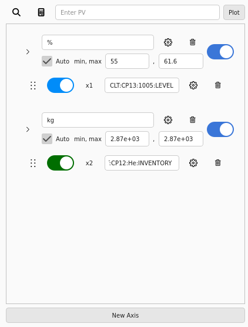

# Y-Axes

Users are able to manage the axes on their plot in the [configuration section].
From adding/removing axes, hiding axes, or changing an axis' properties, users have plenty of control over the Y-Axes of their plot.

  [configuration section]: overview/config_section.md

<figure markdown="span">
  
</figure>

## Adding Axes

Users can create new Y-axes to organize [traces] by clicking the button labeled "New Axis" at the bottom of the configuration section.
The new axis won't have any associated traces on creation, but the can be added and configured.

  [traces]: traces.md

## Renaming Axes

By default, new Y-axes are names "Y-Axis <#>" where `<#>` is an incrementing number.
Users are able to rename an axis by editing the text in the associate text box.

## Deleting Axes

Users can remove axes by clicking the :fontawesome-regular-trash-can: button for the given axis on the right side of the section.
Deleting an axis will remove the axis from both the table and the plot, as well as all of the traces attached to that axis.

## Hiding Axes

Users have the option to hide/show Y-axes on the plot using the checkbox labeled "Active" on the right side of the section.
Hiding a Y-axis will hide all traces attached to it as well.

## Axis Settings

Users can change an axis' vertical range and settings on an axis-by-axis basis.

Some of an axis' settings can be configured by clicking the associated :octicons-gear-16: button on the right side of the section.
This will open a pop-up window that allows for a lot of customization of the axis.
It looks like this.

<figure markdown="span">
  
</figure>

### Vertical Range

An axis' range can be changed in a few different ways.
By default, an axis will automatically scale its range to show all data for its traces.
This feature can be enabled/disabled using the checkbox labeled "Auto".
It will also be automatically disabled if the user changes the range manually in one of the following ways.

Another, more common way for users to change the range is by scrolling/dragging on the plot.
This can be done on individual axes or on all axes at once.
See [Mouse Controls] for more details.

  [Mouse Controls]: overview/plot_section.md#mouse-controls

Finally, users also have the option to set the range manually by altering the values in the text boxes labeled `min, max` in the configuration section.
This will result in the Y-axis being locked at that range, even if trace data isn't in that range.

### Orientation

Sets if the axis is displayed on the left or right side of the plot.
This doesn't affect the data or the plot and is purely a cosmetic change.

### Log Mode

Sets if the axis is on a linear scale or a [logarithmic scale].

  [logarithmic scale]: https://en.wikipedia.org/wiki/Logarithmic_scale

### Y-Axis Gridline

Sets if gridlines are shown on the plot.
These will be horizontal lines at all major ticks on the Y-axis.

Gridlines can be enabled/disabled individually here, or enabled/disabled for all axes in the [plot settings] pop-up.

  [plot settings]: plot_config.md
